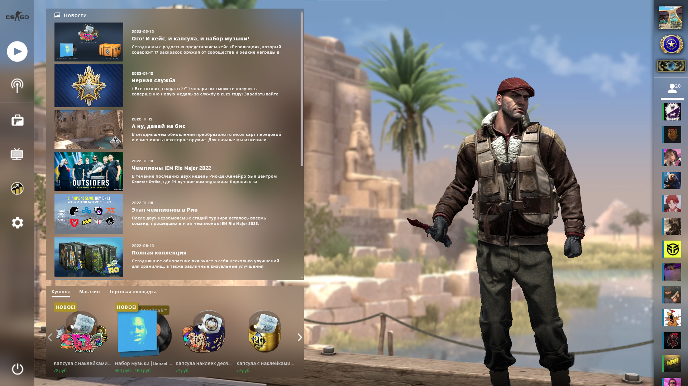
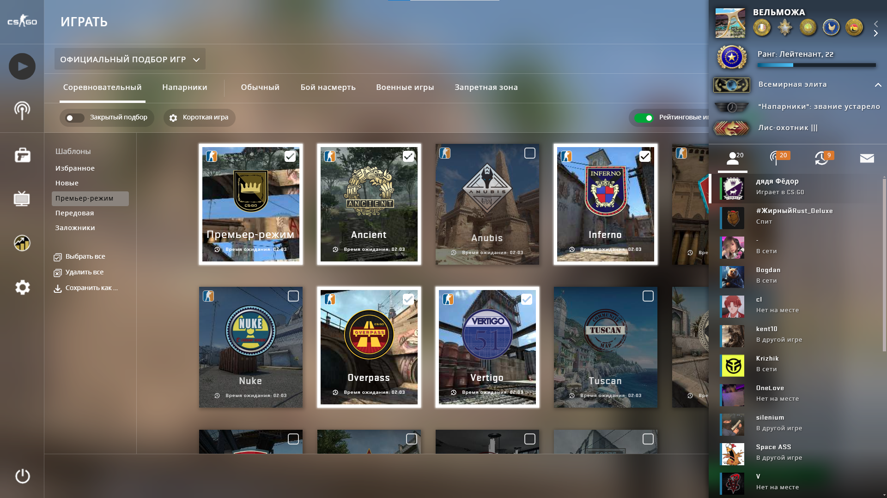
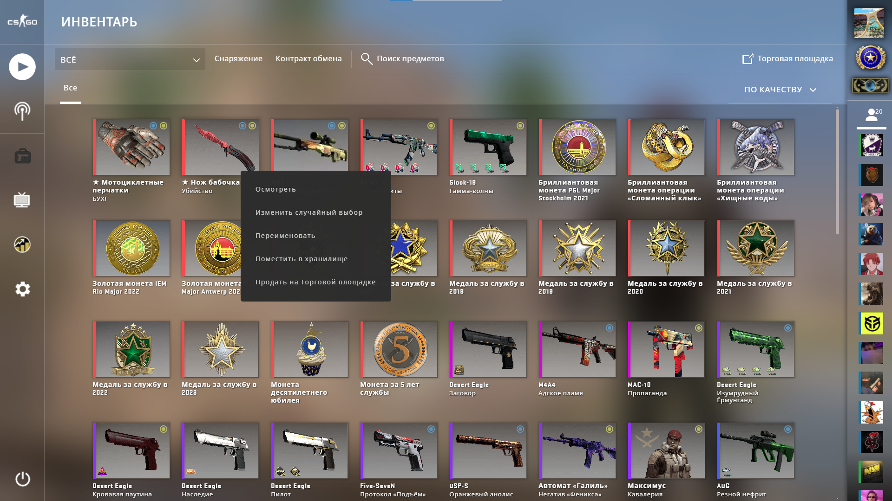
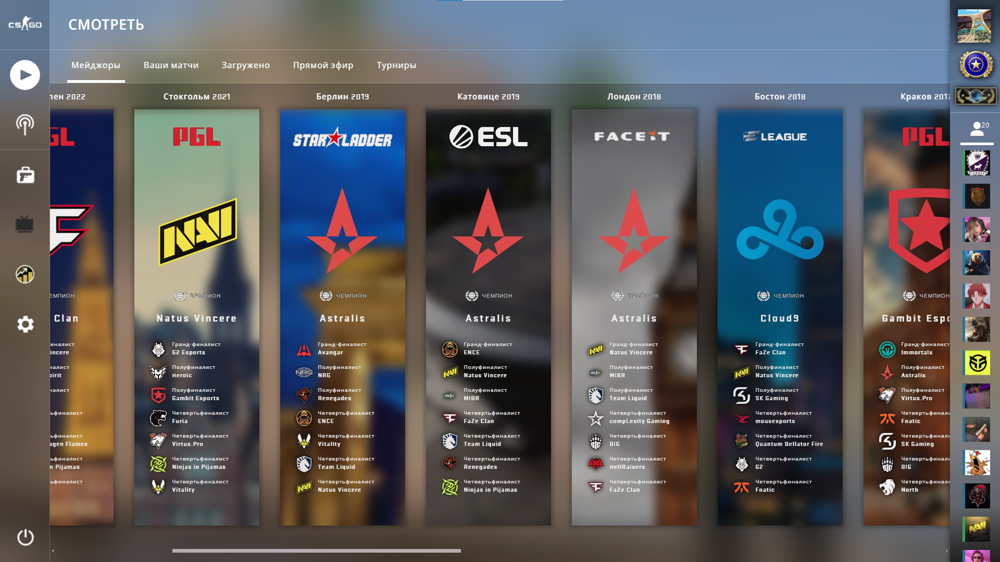
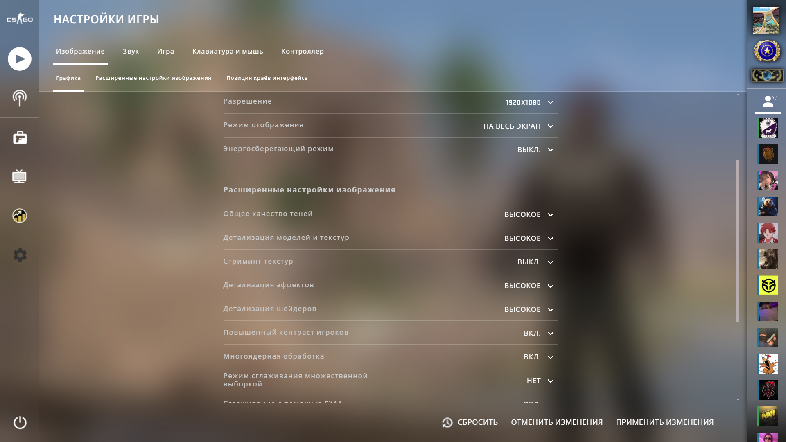

# Проект КС
Пытается повторить меню всеми известной игры
## Ссылка на GHPages: https://alkorotkovv.github.io/cs-go/
## Стек:
- Flex
- Grid
- Адаптивная верстка
- БЭМ
- SASS
- Использование переменных из JS в CSS
- React
## Требуется доработать:
- Анимации
- Шрифты
- Адаптивность
- Размеры картинок
- Всплывающие подсказки
- Отступы для PixelPerfect
- Цвет разделяющих линий
- Логику шаблонов и длины игр в соревновательном режиме
- Сделать профиль отдельным компонентом
- Массив игроков для зоны + верстка зоны
- Обработка нажатий ESC
- Сделать список серверов не картинкой
## Скриншоты приложения

